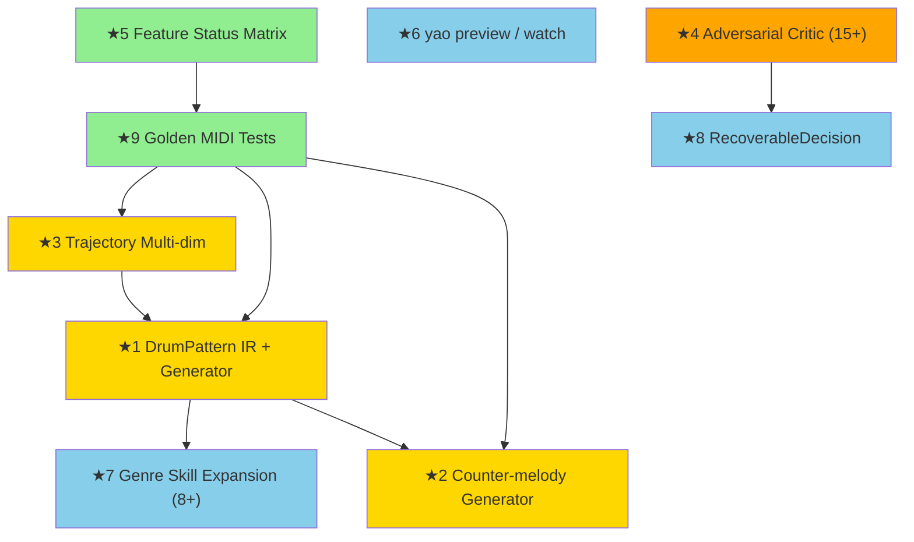

# v1.1 Baseline Report — Pre-Implementation Snapshot

> Generated: 2026-04-30
> Purpose: Establish the exact state of the codebase before any v1.1 improvement (★1–★9) is implemented.
> This report is an **observation**, not a plan. It records facts for use as the baseline against which improvements are measured.

---

## Section 1: Existing Code State by Layer

### Codebase Summary

| Metric | Value |
|--------|-------|
| Total Python source (src/yao/) | 12,388 lines |
| Total test code (tests/) | 7,813 lines |
| Tests collected | 580 |
| Test files | 46 (39 unit, 3 integration, 2 scenario, 1 golden, 1 music_constraints) |
| Source modules | 85 Python files |
| Make all-checks | All passing |

### Layer-by-Layer Observation

#### Layer 0: Constants (`src/yao/constants/`)

| Feature | Status | Files | Notes |
|---------|--------|-------|-------|
| Instrument ranges (38 instruments) | ✅ | instruments.py (147L) | MIDI ranges, GM program numbers |
| MIDI constants | ✅ | midi.py (57L) | PPQ, velocity bounds |
| Music theory constants | ✅ | music.py (118L) | Scales, chords, dynamics, intervals |

#### Layer 1: Specification (`src/yao/schema/`)

| Feature | Status | Files | Notes |
|---------|--------|-------|-------|
| composition.yaml v1 (Pydantic) | ✅ | composition.py (114L) | CompositionSpec, SectionSpec, InstrumentSpec |
| composition.yaml v2 (11 sections) | ✅ | composition_v2.py (731L) | 22 Pydantic models |
| trajectory.yaml | ✅ | trajectory.py (115L) | 3-dim TrajectorySpec (tension, density, predictability) |
| intent.md | 🟡 | intent.py (56L) | IntentSpec exists; no auto-evaluation linkage |
| constraints + scope | ✅ | constraints.py (89L) | must/must_not/prefer/avoid |
| negative-space.yaml | 🟡 | negative_space.py | Schema exists, reflection mechanism incomplete |
| references.yaml | 🟡 | references.py | Schema exists, matcher not connected |
| production.yaml | 🟡 | production.py | Schema exists, mix chain not implemented |
| project.py | ✅ | project.py (102L) | CompositionProject loader |

#### Layer 2: Generation Strategy (`src/yao/generators/`)

| Feature | Status | Files | Notes |
|---------|--------|-------|-------|
| rule_based generator | ✅ | rule_based.py (468L) | Deterministic; trajectory: tension→velocity only |
| stochastic generator | ✅ | stochastic.py (1212L) | seed/temperature/contour; trajectory: tension→velocity+pitch+leaps, density→rhythm subdivision, register_height→octave offset |
| Generator registry | ✅ | registry.py (49L), base.py (47L) | @register_generator decorator |
| drum_patterner | 🔴 | NOT PRESENT | v1.1 ★1 target |
| counter_melody | 🔴 | NOT PRESENT | v1.1 ★2 target |
| **Plan generators (v2.0 artifact)** | ✅ | generators/plan/ (560L) | FormPlanner, HarmonyPlanner, PlanOrchestrator |
| **Note realizers (v2.0 artifact)** | ✅ | generators/note/ (3 files) | rule_based + stochastic wrappers |
| **Legacy adapter (v2.0 artifact)** | ✅ | legacy_adapter.py (140L) | v1→v2 pipeline bridge, returns (ScoreIR, MusicalPlan, ProvenanceLog) |

**Observation**: The codebase contains a full v2.0-era plan layer (generators/plan/, generators/note/, ir/plan/) that was implemented in prior work sessions. PROJECT.md v1.1 §5 does not reference this structure. The `ir/plan/` directory (1260L) contains MusicalPlan, MotifPlan, PhrasePlan, DrumPattern, ArrangementPlan, GlobalContext — types that exist but are not used by the generators listed in v1.1's design.

#### Layer 3: IR (`src/yao/ir/`)

| Feature | Status | Files | Notes |
|---------|--------|-------|-------|
| ScoreIR (Note, Part, Section) | ✅ | score_ir.py (233L), note.py (87L) | Frozen dataclasses |
| Motif IR | ✅ | motif.py (86L) | Motif, invert, retrograde, transpose |
| Harmony IR | ✅ | harmony.py (82L) | diatonic_quality, chord functions |
| Voicing IR | ✅ | voicing.py (92L) | Voice-crossing detection |
| Trajectory IR | ✅ | trajectory.py (194L) | MultiDimensionalTrajectory (5 dims: tension, density, predictability, brightness, register_height) |
| Timing IR | ✅ | timing.py (72L) | bars_to_beats, beats_to_bars |
| Notation IR | ✅ | notation.py (117L) | note_name_to_midi, midi_to_note_name |
| DrumPattern (Layer 3, not at ir/drum.py) | ✅ (misplaced) | ir/plan/drums.py (168L) | DrumHit, DrumPattern, KitPiece, FillLocation — exists as plan type, not at v1.1's expected location |
| **Plan IR (v2.0 artifact)** | ✅ | ir/plan/ (1260L total) | SongFormPlan, HarmonyPlan, MotifPlan, PhrasePlan, ArrangementPlan, GlobalContext, MusicalPlan |

**Observation**: v1.1 expects `src/yao/ir/drum.py` (★1). A DrumPattern type already exists at `src/yao/ir/plan/drums.py` with DrumHit, KitPiece, FillLocation types (168L). It was implemented as part of the v2.0 plan layer.

#### Layer 4: Perception Substitute

| Feature | Status | Files | Notes |
|---------|--------|-------|-------|
| Perception layer | 🔴 | __init__.py only (3L) | Empty skeleton |

#### Layer 5: Rendering (`src/yao/render/`)

| Feature | Status | Files | Notes |
|---------|--------|-------|-------|
| MIDI writer | ✅ | midi_writer.py | per-instrument MIDI |
| Stem writer | ✅ | stem_writer.py | per-instrument stems |
| Audio renderer (FluidSynth) | ✅ | audio_renderer.py | Optional dependency |
| MIDI reader | ✅ | midi_reader.py | MIDI → ScoreIR |
| Iteration management | ✅ | iteration.py | v001/v002/... |
| MusicXML writer | ⚪ | NOT PRESENT | |
| LilyPond writer | ⚪ | NOT PRESENT | |

#### Layer 6: Verification (`src/yao/verify/`)

| Feature | Status | Files | Notes |
|---------|--------|-------|-------|
| Music lint | ✅ | music_lint.py (199L) | Parallel fifths, voice leading |
| Score analyzer | ✅ | analyzer.py | Structure, melody, harmony analysis |
| Evaluator (5-dim + quality score) | ✅ | evaluator.py (505L) | MetricGoal-based, 10 metrics |
| Score diff | ✅ | diff.py | Modified notes tracking |
| MetricGoal type system | ✅ | metric_goal.py (297L) | 7 goal types |
| Constraint checker | ✅ | constraint_checker.py (250L) | Range, voice constraints |
| **Critique rules (12)** | ✅ | critique/ (950L, 8 files) | CritiqueRule, Finding, CritiqueRegistry + 12 rules across 5 roles |

**Observation**: v1.1 PROJECT.md §4 lists "rule-based critique 機械検出(15+)" as 🔴. However, 12 rules already exist in `src/yao/verify/critique/` with types, registry, and implementations across structural (3), harmonic (3), melodic (3), rhythmic (1), emotional (2) roles. Tests exist in `tests/unit/verify/test_critique_rules.py`.

#### Layer 7: Reflection (`src/yao/reflect/`)

| Feature | Status | Files | Notes |
|---------|--------|-------|-------|
| ProvenanceLog | ✅ | provenance.py (260L) | Append-only, queryable, JSON persistence |
| RecoverableDecision | ✅ | recoverable.py (50L) | Implemented, with 9 registered codes |
| Recoverable codes | ✅ | recoverable_codes.py (43L) | VELOCITY_CLAMPED, NOTE_OUT_OF_RANGE, etc. |

**Observation**: v1.1 PROJECT.md §4 lists "RecoverableDecision logging" as 🔴 (★8). However, `src/yao/reflect/recoverable.py` already implements RecoverableDecision with severity, musical_impact, suggested_fix fields. It is integrated into ProvenanceLog.record_recoverable(). Both generators use it for velocity clamping and out-of-range handling. Tests exist at `tests/unit/verify/test_recoverable.py`. The file is at `reflect/recoverable.py`, not `verify/recoverable.py` as v1.1 expects.

#### Conductor (`src/yao/conductor/`)

| Feature | Status | Files | Notes |
|---------|--------|-------|-------|
| Conductor class | ✅ | conductor.py (492L) | compose_from_description, compose_from_spec, regenerate_section |
| Feedback adaptations | ✅ | feedback.py (328L) | Evaluator-based + critic-findings-based adaptations |
| ConductorResult | ✅ | result.py (90L) | Includes critic_findings field, shows in summary() |
| Critic integration | ✅ | conductor.py:153 | CRITIQUE_RULES.run_all() called in loop, findings → adaptations |
| SpecCompiler delegation | ✅ | conductor.py → sketch/compiler.py | Music theory extracted from Conductor |

#### Sketch (`src/yao/sketch/`)

| Feature | Status | Files | Notes |
|---------|--------|-------|-------|
| SpecCompiler | ✅ | compiler.py (310L) | NL→spec: mood→key, pace→tempo, keyword→instruments, explicit key regex |

#### CLI (`src/cli/main.py`)

| Feature | Status | Notes |
|---------|--------|-------|
| yao compose | ✅ | |
| yao conduct | ✅ | NL description or spec path |
| yao render | ✅ | MIDI → WAV |
| yao validate | ✅ | |
| yao evaluate | ✅ | |
| yao diff | ✅ | |
| yao explain | ✅ | |
| yao new-project | ✅ | |
| yao regenerate-section | ✅ | |
| yao preview | 🔴 | v1.1 ★6 target |
| yao watch | 🔴 | v1.1 ★6 target |

#### Golden MIDI Tests

| Feature | Status | Files | Notes |
|---------|--------|-------|-------|
| Golden test infrastructure | ✅ | tests/golden/ | 6 baselines (3 specs × 2 realizers), comparison.py, regenerate_goldens.py |
| make test-golden | ✅ | Makefile | 6 tests passing |

**Observation**: v1.1 PROJECT.md §4 lists "golden MIDI tests" as 🔴 (★9). However, the infrastructure already exists with 6 golden baselines, comparison logic, and a regeneration tool with `--reason --confirm` flags.

---

## Section 2: Document–Implementation Alignment Gaps

### Test Count Discrepancies

| Source | Stated Count | Actual |
|--------|-------------|--------|
| PROJECT.md v1.1 §4 (Feature Matrix "Tests" row) | "226 テスト" | 580 |
| PROJECT.md v1.1 §5 (directory listing) | "207 tests" (unit), "2 tests" (integration), "7" (music_constraints), "10" (scenarios) | ~500 (unit), ~15 (integration), 7 (music_constraints), ~16 (scenarios) |
| README.md | "580 tests" | 580 ✅ (aligned) |
| CLAUDE.md v1.1 | No specific test count stated | N/A |

### Feature Status Matrix vs Code Reality

These entries in PROJECT.md v1.1 §4 are listed as 🔴 but have existing implementations:

| Feature | Matrix Status | Actual Code | Evidence |
|---------|--------------|-------------|----------|
| DrumPattern IR | 🔴 | ✅ (ir/plan/drums.py, 168L) | DrumHit, DrumPattern, KitPiece, FillLocation dataclasses with serialization |
| rule-based critique (15+) | 🔴 | 12 rules implemented | verify/critique/ (950L), 12 rules, tests in test_critique_rules.py |
| RecoverableDecision logging | 🔴 | ✅ (reflect/recoverable.py, 50L) | Integrated into ProvenanceLog, used by both generators |
| golden MIDI tests | 🔴 | ✅ (tests/golden/, 6 baselines) | test_golden.py, comparison.py, regenerate_goldens.py |
| Feature Status Matrix | 🔴 | 🟡 (Capability Matrix in PROJECT.md §4 exists, but FEATURE_STATUS.md and tools/feature_status_check.py do not) | Matrix exists in PROJECT.md; standalone file and tool do not |
| trajectory 多次元連動 | 🔴 | 🟡 (stochastic: tension→pitch/leaps, density→rhythm, register_height→octave; rule_based: tension→velocity only; harmony_planner: tension→chord selection + secondary dominants) | Stochastic is multi-dim; rule_based is not |

### Files Expected by v1.1 but Not Present

| Expected Path (PROJECT.md §5) | Exists? | What Exists Instead |
|-------------------------------|---------|---------------------|
| `src/yao/ir/drum.py` | ❌ | `src/yao/ir/plan/drums.py` (different path, v2.0 artifact) |
| `src/yao/generators/drum_patterner.py` | ❌ | No drum pattern generator |
| `src/yao/generators/counter_melody.py` | ❌ | No counter-melody generator |
| `src/cli/preview.py` | ❌ | No preview CLI command |
| `src/cli/watch.py` | ❌ | No watch CLI command |
| `FEATURE_STATUS.md` | ❌ | Capability Matrix embedded in PROJECT.md §4 |
| `tools/feature_status_check.py` | ❌ | `tools/capability_matrix_check.py` exists (v2.0 artifact, different schema) |
| `drum_patterns/` directory | ❌ | No drum pattern YAML files |
| `src/yao/verify/recoverable.py` | ❌ | `src/yao/reflect/recoverable.py` (different path) |

### Files Present but Not Referenced by v1.1

| Path | Description | Origin |
|------|-------------|--------|
| `src/yao/ir/plan/` (9 files, 1260L) | Full MPIR layer: MusicalPlan, MotifPlan, PhrasePlan, DrumPattern, ArrangementPlan, GlobalContext | v2.0 implementation |
| `src/yao/generators/plan/` (5 files, 560L) | FormPlanner, HarmonyPlanner, PlanOrchestrator | v2.0 implementation |
| `src/yao/generators/note/` (4 files) | NoteRealizerBase, rule_based + stochastic realizer wrappers | v2.0 implementation |
| `src/yao/generators/legacy_adapter.py` | v1→v2 pipeline bridge | v2.0 implementation |
| `src/yao/sketch/compiler.py` (310L) | SpecCompiler: NL→spec with mood/tempo/instrument inference | v2.0 implementation |
| `src/yao/schema/composition_v2.py` (731L) | Full v2 spec with 22 Pydantic models | v2.0 implementation |
| `src/yao/verify/metric_goal.py` (297L) | MetricGoal type system (7 goal types) | v2.0 implementation |

### CLI Command Discrepancy

v1.1 CLAUDE.md §5 directory layout lists separate CLI files (`cli/compose.py`, `cli/conduct.py`, etc.). Actual implementation uses a single `src/cli/main.py` with Click commands.

### Skill Files

| Skill Directory | Files Present | Content Status |
|----------------|---------------|----------------|
| .claude/skills/genres/ | cinematic.md (46L) | Populated with tempo/keys/progressions/instrumentation |
| .claude/skills/theory/ | voice-leading.md | Populated |
| .claude/skills/instruments/ | piano.md | Populated |
| .claude/skills/psychology/ | tension-resolution.md | Populated |

---

## Section 3: Silent Fallback Inventory

The following locations contain value clamping, defaulting, or fallback behavior. Each is a candidate for RecoverableDecision wrapping (★8).

### Already Wrapped (Using RecoverableDecision)

| File | Line | Pattern | Status |
|------|------|---------|--------|
| `generators/rule_based.py` | 419-429 | `clamped = max(1, min(127, base_velocity))` | ✅ Wrapped with RecoverableDecision VELOCITY_CLAMPED |
| `generators/stochastic.py` | 522-535 | `final_vel = max(1, min(127, raw_vel))` | ✅ Wrapped with RecoverableDecision VELOCITY_CLAMPED |
| `generators/stochastic.py` | 1161-1171 | `clamped = max(1, min(127, base_velocity))` | ✅ Wrapped |
| `generators/stochastic.py` | 488-521 | Melody note out of range → bounce/skip | ✅ Wrapped with MELODY_NOTE_SKIPPED / MELODY_NOTE_OUT_OF_RANGE |
| `generators/stochastic.py` | 599-623 | Motif note out of range → octave adjust | ✅ Wrapped with MOTIF_NOTE_OUT_OF_RANGE |
| `generators/stochastic.py` | 792-800 | Bass note out of range → use root | ✅ Wrapped |
| `generators/stochastic.py` | 935-951 | Chord quality undefined → default to major | ✅ Wrapped with CHORD_QUALITY_UNDEFINED |

### Not Wrapped (Silent Defaults)

| File | Line | Pattern | Description |
|------|------|---------|-------------|
| `ir/trajectory.py` | 55 | `return 0.5` | TrajectoryCurve.value_at returns 0.5 for stepped type without matching section |
| `ir/trajectory.py` | 73 | `return 0.5` | TrajectoryCurve.value_at returns 0.5 when no waypoints and no target |
| `ir/trajectory.py` | 126 | `return 0.5` | MultiDimensionalTrajectory.value_at returns 0.5 for unknown dimension |
| `ir/plan/musical_plan.py` | 45 | `key: str = "C major"` | GlobalContext defaults key to C major |
| `schema/trajectory.py` | 62, 78, 109 | `return 0.5` | TrajectorySpec.value_at returns 0.5 for missing dimensions |
| `schema/composition.py` | 79 | `temperature: float = 0.5` | Default temperature |
| `schema/composition.py` | 101 | `key: str = "C major"` | Default key |
| `schema/composition_v2.py` | 75 | `key: str = "C major"` | Default key |
| `schema/composition_v2.py` | 141-144 | `valence/energy/tension/warmth: float = 0.5` | Emotion defaults |
| `schema/composition_v2.py` | 173 | `density: float = 0.5` | Section density default |
| `generators/stochastic.py` | 452 | `density = 0.5` | Density default when no trajectory |
| `generators/stochastic.py` | 472 | `bar_tension = 0.5` | Tension default when no trajectory |
| `generators/stochastic.py` | 634 | `max(1, min(127, velocity + vel_variation))` | Motif velocity clamp without RecoverableDecision |
| `generators/rule_based.py` | 292, 338 | `_validate_and_clamp_note(note, instrument)` | Calls validate_range() which raises, but method name says "clamp" |
| `verify/evaluator.py` | 207-208 | `target = 0.5; tolerance = 0.5` | Evaluator score defaults |
| `verify/metric_goal.py` | 272, 285 | `return 0.5` | Metric scoring defaults |

### try/except Patterns

No `try: ... except: pass` patterns found in `src/yao/`. All exception handling includes explicit error messages or re-raises.

---

## Section 4: Improvement Dependency Graph

### Files Touched by Each Improvement

| ★ | Files to Create | Files to Modify | Existing Code to Leverage |
|---|----------------|-----------------|--------------------------|
| ★1 | `src/yao/ir/drum.py`, `src/yao/generators/drum_patterner.py`, `drum_patterns/*.yaml` | `schema/composition.py`, generators, render | `ir/plan/drums.py` (DrumPattern types already exist) |
| ★2 | `src/yao/generators/counter_melody.py` | `schema/composition.py` (counter_melody role) | `ir/voicing.py`, `ir/motif.py` |
| ★3 | None | `generators/rule_based.py`, `generators/stochastic.py`, `ir/trajectory.py` | Stochastic already partial; extend to rule_based |
| ★4 | Additional rules in `verify/critique/` | `conductor/conductor.py`, `conductor/feedback.py` | 12 rules + registry + Finding types already exist |
| ★5 | `FEATURE_STATUS.md`, `tools/feature_status_check.py` | `README.md`, `Makefile` | `tools/capability_matrix_check.py` (similar tool exists) |
| ★6 | `src/cli/preview.py`, `src/cli/watch.py` | `pyproject.toml` (sounddevice, watchdog) | `render/audio_renderer.py` |
| ★7 | `.claude/skills/genres/*.md` (7 files) | None | `skills/genres/cinematic.md` (template) |
| ★8 | None (already exists) | Remaining silent fallback sites | `reflect/recoverable.py` (already implemented) |
| ★9 | None (already exists) | None | `tests/golden/` (already implemented with 6 baselines) |

---

## Section 5: Migration Risk Assessment

### Backward Compatibility Risks

| Improvement | Risk Level | Detail |
|------------|-----------|--------|
| ★1 DrumPattern | LOW | New `drums:` field in spec is additive; existing specs without it continue to work |
| ★2 Counter-melody | LOW | New `counter_melody` role is additive; existing roles unchanged |
| ★3 Trajectory multi-dim | MEDIUM | Changing rule_based generator behavior may alter output for existing specs. Golden tests will detect regression. |
| ★4 Critic rules | LOW | Adding rules doesn't change generation; only adds findings |
| ★5 Feature Status | NONE | Documentation only |
| ★6 preview/watch | LOW | New CLI commands; no existing behavior changed |
| ★7 Genre Skills | NONE | New Markdown files; no code changes |
| ★8 RecoverableDecision | LOW | Wrapping existing fallbacks doesn't change behavior, only adds logging |
| ★9 Golden tests | NONE | Already implemented; no behavior change |

### Existing Test Impact

| Improvement | Tests at Risk | Mitigation |
|------------|--------------|------------|
| ★3 Trajectory multi-dim (rule_based changes) | `test_generator.py` (15 tests), `test_trajectory_compliance.py` (6 tests), golden tests (6) | Run `make test-golden` before and after; regenerate goldens with documented reason |
| ★1 DrumPattern | None (new code) | Add new tests; existing tests unaffected |
| ★4 Critic rules | `test_critique_rules.py` (26 tests) may need updates if Finding schema changes | Additive only; existing tests should pass |
| All others | No tests at risk | |

### Performance Impact

| Improvement | Impact | Baseline |
|------------|--------|----------|
| ★1 DrumPattern generation | +50-100ms per generation (new instrument) | Current 8-bar: <500ms |
| ★3 Trajectory multi-dim | Negligible (adds per-bar lookups) | Lookups are O(1) interpolation |
| ★4 Critic rules (+3 rules) | +50ms per evaluation | Current 12-rule evaluation: <100ms |
| ★6 preview | New dependency (sounddevice) but no impact on generate path | N/A |

### Structural Observation

The codebase contains two architectural layers that coexist:

1. **v1.0 path**: `generators/rule_based.py` and `generators/stochastic.py` accept `CompositionSpec` directly and produce `(ScoreIR, ProvenanceLog)`.
2. **v2.0 path**: `generators/legacy_adapter.py` → `generators/plan/orchestrator.py` → `generators/note/` realizers, which route through `MusicalPlan` (MPIR).

The Conductor's `compose_from_spec()` uses the v2.0 path (`generate_via_v2_pipeline`). The v2.0 path internally calls the v1.0 generators via note realizer wrappers. Both paths ultimately reach the same `rule_based.py` and `stochastic.py` generation logic.

v1.1's ★1–★9 improvements are designed for the v1.0 path (direct generator extension). The v2.0 path will inherit changes automatically because it wraps the v1.0 generators.

---

*End of baseline report. This document will not be updated — it captures the pre-improvement state.*
