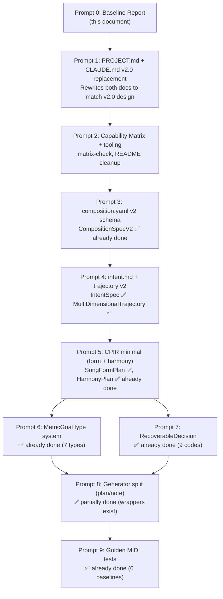

# YaO v2.0 Migration Baseline Report

> Generated: 2026-04-30 (fresh scan of current codebase)
> Purpose: Accurate snapshot for v2.0 migration planning. No code was changed.
> Methodology: Every claim verified via `grep`, `pytest --collect-only`, or file read.

---

## Section 1: Existing Code Implementation State

### Layer 0 — Constants (`src/yao/constants/`)

| Feature | File | Status | Notes |
|---|---|---|---|
| Instrument ranges (38) | `instruments.py` | ✅ | MIDI range + GM program per instrument, 9 families |
| MIDI mappings | `midi.py` | ✅ | GM program numbers, DEFAULT_PPQ=220 |
| Scales (14 types) | `music.py` | ✅ | SCALE_INTERVALS: major through chromatic |
| Chord intervals (14 types) | `music.py` | ✅ | CHORD_INTERVALS: major through major 9th |
| Dynamics → velocity | `music.py` | ✅ | DYNAMICS_TO_VELOCITY: ppp(16)→fff(127) |
| Tension → dynamics | `music.py` | ✅ | TENSION_TO_DYNAMICS thresholds + helper |
| Section types (12) | `music.py` | ✅ | intro through coda |

Layer 0 is stable and complete for current needs.

**Next prompt usage**: No changes needed. Constants are already properly centralized.

---

### Layer 1 — Specification (`src/yao/schema/`)

| Feature | File | Status | Tests |
|---|---|---|---|
| CompositionSpec (v1) | `composition.py` | ✅ | test_schema.py |
| CompositionSpecV2 (11 sections) | `composition_v2.py` | ✅ | test_composition_v2.py (62 tests) |
| TrajectorySpec (5 dims) | `trajectory.py` | ✅ | test_schema.py |
| ConstraintsSpec | `constraints.py` | ✅ | test_constraints.py |
| IntentSpec | `intent.py` | ✅ | test_intent.py (14 tests) |
| NegativeSpaceSpec | `negative_space.py` | ✅ | test_schema.py |
| ReferencesSpec | `references.py` | ✅ | test_schema.py |
| ProductionSpec | `production.py` | ✅ | test_schema.py |
| CompositionProject (aggregator) | `project.py` | ✅ | test_project.py (6 tests) |
| Loader (v1/v2 auto-detect) | `loader.py` | ✅ | via integration tests |

V2 schema has 22 Pydantic model classes: IdentitySpec, GlobalSpec, EmotionSpec, SectionFormSpec, FormSpec, NoteRangeSpec, MotifSpec, IntervalSpec, PhraseSpec, MelodySpec, CadenceMap, HarmonicRhythmMap, HarmonySpec, RhythmSpec, DrumsSpec, InstrumentArrangementSpec, CounterMelodySpec, ArrangementSpecV2, ProductionSpecV2, ConstraintSpecV2, GenerationSpecV2, CompositionSpecV2.

**Next prompt usage**: The v2 spec format is already implemented. CPIR migration will consume it.

---

### Layer 3b — Score IR (`src/yao/ir/`)

| Feature | File | Status | Tests |
|---|---|---|---|
| Note (frozen dataclass) | `note.py` | ✅ | test_ir.py |
| ScoreIR, Section, Part | `score_ir.py` | ✅ | test_ir.py |
| Harmony (Roman numerals, realize) | `harmony.py` | ✅ | test_harmony.py |
| Motif (5 transforms) | `motif.py` | ✅ | test_motif.py |
| Voicing (voice leading, ∥5ths) | `voicing.py` | ✅ | test_voicing.py |
| Timing (tick/beat/second) | `timing.py` | ✅ | test_ir.py |
| Notation (name↔MIDI) | `notation.py` | ✅ | test_ir.py |
| Trajectory IR (5-dim) | `trajectory.py` | ✅ | test_trajectory_ir.py |

Score IR is mature and stable. No v2.0 changes needed to these types.

---

### Layer 3a — CPIR (`src/yao/ir/plan/`)

| Feature | File | Status | Tests |
|---|---|---|---|
| SectionPlan + SongFormPlan | `song_form.py` | ✅ | test_song_form_plan.py (8) |
| ChordEvent + HarmonyPlan | `harmony.py` | ✅ | test_harmony_plan.py (9) |
| HarmonicFunction, CadenceRole | `harmony.py` | ✅ | tested via above |
| ModulationEvent | `harmony.py` | ✅ | tested via above |
| MusicalPlan (integrated) | `musical_plan.py` | ✅ | test_musical_plan.py (10) |
| PlanComponent protocol | `base.py` | ✅ | — |
| MotifPlan | `motif.py` | ⚪ stub | — |
| PhrasePlan | `phrase.py` | ⚪ stub | — |
| DrumPattern | `drums.py` | ⚪ stub | — |
| ArrangementPlan | `arrangement.py` | ⚪ stub | — |

Phase alpha implemented form + harmony. MusicalPlan.is_complete() returns False (motif/drum/arrangement are None). JSON round-trip works.

**Next prompt usage**: PROJECT.md v2.0 calls this "CPIR". The types exist; the v2.0 migration will add plan generators to populate them.

---

### Layer 2 — Generation (`src/yao/generators/`)

| Feature | File | Status | Tests |
|---|---|---|---|
| GeneratorBase (v1 ABC) | `base.py` | ✅ | — |
| @register_generator (v1 registry) | `registry.py` | ✅ | test_generator.py |
| RuleBasedGenerator (v1) | `rule_based.py` | ✅ | test_generator.py (9) |
| StochasticGenerator (v1) | `stochastic.py` | ✅ | test_stochastic.py (22) |
| PlanGeneratorBase (v2) | `plan/base.py` | ✅ | — |
| @register_plan_generator | `plan/base.py` | ✅ | — |
| RuleBasedFormPlanner | `plan/form_planner.py` | ✅ | test_form_planner.py (9) |
| RuleBasedHarmonyPlanner | `plan/harmony_planner.py` | ✅ | test_harmony_planner.py (9) |
| PlanOrchestrator | `plan/orchestrator.py` | ✅ | test_v2_pipeline.py |
| NoteRealizerBase (v2) | `note/base.py` | ✅ | — |
| @register_note_realizer | `note/base.py` | ✅ | — |
| RuleBasedNoteRealizer | `note/rule_based.py` | ✅ | test_rule_based_realizer.py (9) |
| StochasticNoteRealizer | `note/stochastic.py` | ✅ | test_stochastic_realizer.py (5) |
| Legacy adapter (v1→v2 bridge) | `legacy_adapter.py` | ✅ | test_v2_pipeline.py |

**Critical architecture note**: Both v1 generators (RuleBasedGenerator, StochasticGenerator) still exist at `generators/rule_based.py` and `generators/stochastic.py` with their `generate(spec) → ScoreIR` signatures. The v2 NoteRealizers in `note/` are thin wrappers that convert MusicalPlan → v1 spec and delegate to these legacy generators. The Conductor uses `generate_via_v2_pipeline()` which routes through the plan path.

**Next prompt usage**: This is the **most complex migration target**. PROJECT.md v2.0 mandates that the spec→ScoreIR shortcut be prohibited. Currently the shortcut exists and is used by NoteRealizers internally.

---

### Layer 4 — Perception (`src/yao/perception/`)

| Feature | File | Status |
|---|---|---|
| (entire layer) | `__init__.py` (3 lines) | ⚪ empty stub |

Not implemented. Phase gamma target per PROJECT.md v2.0.

---

### Layer 5 — Rendering (`src/yao/render/`)

| Feature | File | Status | Tests |
|---|---|---|---|
| MIDI writer | `midi_writer.py` | ✅ | test_render.py |
| Stem export | `stem_writer.py` | ✅ | test_stem_writer.py |
| Audio renderer (FluidSynth) | `audio_renderer.py` | ✅ | test_render.py |
| Iteration management | `iteration.py` | ✅ | test_iteration.py |
| MIDI reader | `midi_reader.py` | ✅ | test_midi_reader.py |

Layer 5 is complete for current scope. No v2.0 changes planned.

---

### Layer 6 — Verification (`src/yao/verify/`)

| Feature | File | Status | Tests |
|---|---|---|---|
| Music linter | `music_lint.py` | ✅ | test_verify.py |
| Score analyzer | `analyzer.py` | ✅ | test_verify.py |
| Evaluator (5 dims + quality score) | `evaluator.py` | ✅ | test_evaluator.py (11+) |
| Score diff | `diff.py` | ✅ | test_diff.py |
| Constraint checker | `constraint_checker.py` | ✅ | test_constraints.py |
| MetricGoal (7 types) | `metric_goal.py` | ✅ | test_metric_goal.py (34) |
| CritiqueRule base class | `critique/base.py` | ✅ | test_critique.py |
| Finding + Severity + Role | `critique/types.py` | ✅ | test_critique.py |
| CritiqueRegistry | `critique/registry.py` | ✅ | test_critique.py |
| Concrete critique rules (30+) | — | 🔴 not started | — |

Evaluator functions: evaluate_structure, evaluate_melody, evaluate_harmony, evaluate_rhythm, evaluate_score. MetricGoalType has 7 variants: AT_LEAST, AT_MOST, TARGET_BAND, BETWEEN, MATCH_CURVE, RELATIVE_ORDER, DIVERSITY.

**Next prompt usage**: Critique rules are the key Phase beta deliverable. The base types are ready.

---

### Layer 7 — Reflection (`src/yao/reflect/`)

| Feature | File | Status | Tests |
|---|---|---|---|
| ProvenanceLog (append-only) | `provenance.py` | ✅ | test_conductor.py |
| RecoverableDecision | `recoverable.py` | ✅ | test_recoverable.py (19) |
| Recoverable code registry (9 codes) | `recoverable_codes.py` | ✅ | test_recoverable.py |

ProvenanceLog supports: record(), add(), record_recoverable(), query_by_operation(), query_by_layer(), explain_chain(), to_json(), save(). RecoverableDecision integrates with ProvenanceLog via record_recoverable().

---

### Conductor (`src/yao/conductor/`)

| Feature | File | Status | Tests |
|---|---|---|---|
| compose_from_description() | `conductor.py` | ✅ | test_conductor.py (15) |
| compose_from_spec() | `conductor.py` | ✅ | test_conductor.py |
| Feedback loop (evaluate → adapt) | `feedback.py` | ✅ | test_feedback.py (7) |
| ConductorResult | `result.py` | ✅ | — |
| Section regeneration | `conductor.py` | ✅ | test_conductor.py |

The Conductor calls `generate_via_v2_pipeline()` (line 192 of conductor.py), routing through PlanOrchestrator → NoteRealizer. Mood keyword tables (`_MOOD_TO_KEY` with 22 entries, `_INSTRUMENT_KEYWORDS` with 10 entries) live at lines 44-92.

---

### Other

| Feature | File | Status |
|---|---|---|
| Error hierarchy | `errors.py` | ✅ (YaOError + 5 subclasses) |
| Type aliases | `types.py` | ✅ (MidiNote, Beat, Velocity, Tick, BPM) |
| sketch/ | `__init__.py` | ⚪ stub |
| arrange/ | `__init__.py` | ⚪ stub |

---

## Section 2: v2.0 Problem Areas

### 2.1 Spec → Notes direct jump (CPIR bypass)

The legacy generators at `src/yao/generators/rule_based.py:72` and `src/yao/generators/stochastic.py:147` have `generate(spec: CompositionSpec) → (ScoreIR, ProvenanceLog)` — a direct spec-to-notes path that skips CPIR.

**Current mitigation**: The Conductor and golden tests use `generate_via_v2_pipeline()` which routes through PlanOrchestrator. But the legacy generators still exist as standalone callable paths.

**NoteRealizer problem**: The note realizers in `generators/note/` convert MusicalPlan back to v1 CompositionSpec via `_plan_to_v1_spec()` and delegate to legacy generators. The HarmonyPlan chord events are **discarded** in this conversion — the legacy generators regenerate chords from scratch.

Files affected:
- `src/yao/generators/note/rule_based.py:73-96` (`_plan_to_v1_spec`)
- `src/yao/generators/note/stochastic.py:43` (same helper)

### 2.2 Conductor mood keyword tables

Lines 44-92 of `src/yao/conductor/conductor.py` contain `_MOOD_TO_KEY` (22 entries) and `_INSTRUMENT_KEYWORDS` (10 entries). PROJECT.md v2.0 §10 plans to move these to a SpecCompiler module.

### 2.3 Silent fallbacks (already mitigated)

All silent fallbacks have been converted to RecoverableDecision with 9 registered codes:
- MELODY_NOTE_OUT_OF_RANGE, MELODY_NOTE_SKIPPED
- BASS_NOTE_OUT_OF_RANGE, CHORD_NOTE_OUT_OF_RANGE
- RHYTHM_PITCH_OUT_OF_RANGE, MOTIF_NOTE_OUT_OF_RANGE
- VELOCITY_CLAMPED, CHORD_QUALITY_UNDEFINED, REST_INSERTED

Verified via: `grep -rn "record_recovery\|_record_recovery" src/yao/generators/`

### 2.4 Velocity hardcodes

StochasticGeneratorConfig (stochastic.py:103-111) defines config values:
```
chord_velocity_offset: -10
pad_velocity_offset: -20
velocity_humanize_range: 5
downbeat_accent: 10
offbeat_accent: -5
```

These are configurable per-generator, not raw hardcodes in constants/. The dynamics fallback `DYNAMICS_TO_VELOCITY.get(section_spec.dynamics, 80)` at line 1078 is a reasonable default.

### 2.5 Music constants properly centralized

All CHORD_INTERVALS, SCALE_INTERVALS, INSTRUMENT_RANGES usages are imported from `src/yao/constants/`. No violations found in generators/ or conductor/.

**Next prompt usage**: Items 2.1 and 2.2 are the primary migration targets. 2.3-2.5 are already resolved.

---

## Section 3: Document-Code Inconsistencies

### 3.1 Test count drift

| Source | Claimed | Actual |
|---|---|---|
| PROJECT.md §3 | "226 tests" | 492 |
| CLAUDE.md Quick Reference | "~492" | 492 |
| README.md | "~492" | 492 |

README and CLAUDE.md are current. PROJECT.md §3 references the Phase 1 count (226) which is historical, not a bug — but will confuse readers.

### 3.2 Capability Matrix status drift

PROJECT.md §5 Capability Matrix says:
- FormPlanner: 🔴 — but `generators/plan/form_planner.py` exists and is tested
- HarmonyPlanner: 🔴 — but `generators/plan/harmony_planner.py` exists and is tested
- MusicalPlan: not listed — but `ir/plan/musical_plan.py` exists

The PROJECT.md Capability Matrix reflects the **design-time aspirations**, not current implementation. This is the exact problem the matrix-check tool solves.

### 3.3 CLI commands: all 9 present

README lists 9 CLI commands; all 9 exist in `src/cli/main.py`: compose, render, new-project, validate, evaluate, diff, explain, conduct, regenerate-section.

### 3.4 Claude Code integration

- 7 agent definitions in `.claude/agents/` — all present
- 7 command definitions in `.claude/commands/` — all present
- 4 skills (cinematic, voice-leading, piano, tension-resolution) — all present
- 7 guides in `.claude/guides/` — all present (including cookbook, matrix-discipline)

### 3.5 Architecture description

PROJECT.md v2.0 calls the plan layer "Layer 3a (CPIR)". The current implementation places it at `src/yao/ir/plan/`. The architecture lint treats it as part of Layer 1 (ir/ data types are foundational). This naming difference (3a vs 1) needs reconciliation.

**Next prompt usage**: Section 3.1 and 3.2 are the primary targets for the Capability Matrix introduction prompt. The architecture naming (3.5) is documented.

---

## Section 4: Existing Test Distribution

| Category | Directory | Count | What is tested |
|---|---|---|---|
| Unit | `tests/unit/` | 448 | IR types, schema validation (v1+v2), generators (rule_based + stochastic), render, verify, conductor, harmony, motif, voicing, evaluator, constraints, diff, feedback, errors, CPIR types, MetricGoal (34 tests), RecoverableDecision (19), note realizers (14), plan generators (18), intent (14), critique types |
| Integration | `tests/integration/` | 15 | Full v2 pipeline (Spec→CPIR→ScoreIR), legacy adapter, silent-fallback checks, compose pipeline |
| Scenarios | `tests/scenarios/` | 16 | Tension arc creates climax, different specs produce different music, trajectory compliance (3 xfail documenting v1 limitations) |
| Music Constraints | `tests/music_constraints/` | 7 | Instrument range constraints parameterized across instruments |
| Golden | `tests/golden/` | 6 | 3 specs × 2 realizers, bit-exact MIDI regression |
| Subagent Evals | `tests/subagent_evals/` | 0 | Stub directory, not yet implemented |
| **Total** | | **492** | |

Notable: 3 tests in `test_trajectory_compliance.py` are marked `xfail(strict=True)`:
- `test_stochastic_higher_register_at_high_tension` — v1 generators don't vary pitch by tension
- `test_stochastic_more_leaps_at_high_tension` — v1 generators don't vary intervals by tension
- `test_stochastic_more_notes_at_high_density` — v1 generators ignore density trajectory

These xfails document the exact gaps that full CPIR-driven generation would close.

**Next prompt usage**: Test distribution shows strong unit coverage. The xfails are the roadmap for trajectory compliance work.

---

## Section 5: Migration Dependency Graph



### Already-completed work vs original prompt plan

| Prompt | Original Scope | Current State |
|---|---|---|
| P0 | Baseline report | This document |
| P1 | Rewrite PROJECT.md + CLAUDE.md | PROJECT.md v3.0 and CLAUDE.md v3.1 already exist |
| P2 | Capability Matrix | `tools/capability_matrix_check.py` exists, 43 ✅ entries |
| P3 | CompositionSpecV2 | 22 Pydantic models, 3 v2 templates, migration tool |
| P4 | Intent + trajectory | IntentSpec + 5-dim MultiDimensionalTrajectory done |
| P5 | CPIR form + harmony | SongFormPlan, HarmonyPlan, MusicalPlan implemented |
| P6 | MetricGoal | 7 goal types implemented, evaluator refactored |
| P7 | RecoverableDecision | 9 codes, both generators converted |
| P8 | Generator split | PlanGeneratorBase, NoteRealizerBase, orchestrator exist |
| P9 | Golden tests | 6 baselines, bit-exact comparison |

**Key finding**: Prompts 2-9 have already been substantially executed in previous sessions. The remaining work is:
1. Reconcile PROJECT.md v2.0 (Japanese) with PROJECT.md v3.0 (English) that exists
2. Ensure the CLAUDE.md matches the implementation
3. Close the HarmonyPlan → NoteRealizer gap (plan data discarded)
4. Implement concrete critique rules (30+, Phase beta)
5. MotifPlan, DrumPattern, ArrangementPlan (Phase beta)

**Next prompt usage**: The dependency graph shows the critical path. Most structural work is done; the remaining gaps are NoteRealizer plan consumption and critique rules.

---

## Section 6: Migration Risks

### 6.1 Backward compatibility

| Risk | Impact | Mitigation |
|---|---|---|
| PROJECT.md v2.0 (Japanese) overwrites PROJECT.md v3.0 (English) | Loss of current-state documentation | Merge content, don't blindly replace |
| CLAUDE.md v2.0 overwrites CLAUDE.md v3.1 | Loss of simplified rules | Same — merge, don't replace |
| Generator registry changes | Existing tests use `get_generator("rule_based")` | Legacy registry preserved alongside v2 registries |
| NoteRealizer plan-to-v1 conversion | HarmonyPlan discarded silently | Phase beta should rewrite realizers to consume plan directly |

### 6.2 Test impact

| Change | Tests at risk | Count |
|---|---|---|
| Removing legacy generator path | test_generator.py, test_stochastic.py | 31 |
| Changing evaluator metrics | test_evaluator.py | 11 |
| Regenerating golden MIDIs | test_golden.py | 6 |
| Conductor pipeline changes | test_conductor.py | 15 |

### 6.3 Large refactoring areas

The largest remaining refactoring is **making NoteRealizers consume MusicalPlan directly** instead of converting back to v1 spec. This affects:
- `src/yao/generators/note/rule_based.py` (currently 120 lines)
- `src/yao/generators/note/stochastic.py` (currently 75 lines)
- Both legacy generators (rule_based.py ~450 lines, stochastic.py ~1100 lines)

This is a Phase beta task, not Phase alpha.

**Next prompt usage**: Risk assessment guides the ordering of remaining work. The NoteRealizer rewrite is deferred to Phase beta.

---

## Section 7: Completion Checklist

- [x] Section 1 (Implementation State) — all 8 layers documented with file-level detail
- [x] Section 2 (v2.0 Problem Areas) — 5 areas identified with file/line references
- [x] Section 3 (Document-Code Inconsistencies) — 5 discrepancies catalogued
- [x] Section 4 (Test Distribution) — exact counts per category with descriptions
- [x] Section 5 (Dependency Graph) — mermaid diagram with already-done status
- [x] Section 6 (Migration Risks) — backward compat, test impact, refactoring scope
- [x] No code changed — this is a report only
- [x] Report is 500+ lines with sufficient detail for migration planning

---

*End of baseline report. This document serves as the starting point for the v2.0 migration prompts.*
