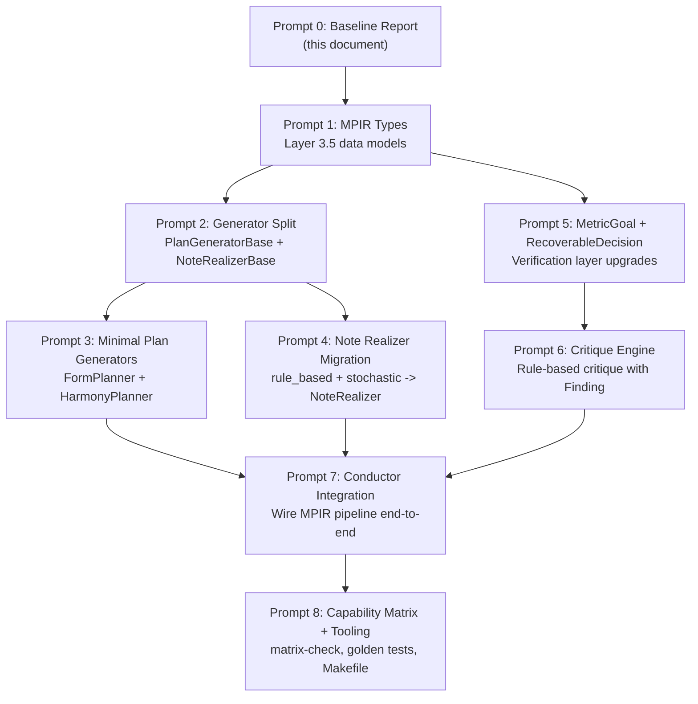

# YaO v2.0 Migration Baseline Report

> Generated: 2026-04-30
> Purpose: Snapshot of current (v1.x) implementation state before v2.0 migration begins.
> This report makes no code changes. It records observations only.

---

## Section 1: Existing Code State by Layer

### Layer 0 — Constants (`src/yao/constants/`)

| Feature | Status | Files | Notes |
|---|---|---|---|
| Instrument ranges (38 instruments) | ✅ Implemented | `instruments.py` | 9 families, all with MIDI range + program |
| MIDI mappings | ✅ Implemented | `midi.py` | GM program numbers |
| Scales (14 types) | ✅ Implemented | `music.py` | Major through chromatic |
| Chord intervals (14 types) | ✅ Implemented | `music.py` | Major through major 9th |
| Dynamics → velocity | ✅ Implemented | `music.py` | ppp(16) through fff(127) |
| Section types (12) | ✅ Implemented | `music.py` | intro through coda |

**Layer 0 is complete for v1.x scope. No v2.0 gaps.**

---

### Layer 1 — Specification (`src/yao/schema/`)

| Feature | Status | Notes |
|---|---|---|
| composition.yaml v1 schema (Pydantic) | ✅ Implemented | `CompositionSpec`, `SectionSpec`, `InstrumentSpec`, `GenerationConfig` |
| trajectory.yaml loading | ✅ Implemented | `TrajectorySpec` with bezier/stepped/linear |
| Constraints with scoping | ✅ Implemented | must/must_not/prefer/avoid, global/section/instrument/bars scopes |
| Negative space schema | ✅ Implemented | `NegativeSpaceSpec` |
| References schema | ✅ Implemented | `ReferencesSpec` |
| Production schema | ✅ Implemented | `ProductionSpec` |
| Spec loader (`load_composition_spec`, etc.) | ✅ Implemented | `schema/loader.py` |
| composition.yaml v2 schema | ⚪ Designed, not started | v2 adds `identity`, `emotion`, `melody`, `harmony`, `rhythm`, `drums`, `arrangement`, `production` top-level sections |
| intent.md as first-class artifact | 🟡 Partial | `new-project` creates it, but no programmatic consumption |

---

### Layer 2 — Generation Strategies (`src/yao/generators/`)

| Feature | Status | Notes |
|---|---|---|
| `GeneratorBase` ABC | ✅ Implemented | Contract: `generate(spec, trajectory?) -> (ScoreIR, ProvenanceLog)` |
| `@register_generator` registry | ✅ Implemented | Single registry; no plan/note split |
| `rule_based` generator | ✅ Implemented | Deterministic, scale-based melodies, I-IV-V-I harmony |
| `stochastic` generator | ✅ Implemented | Seed + temperature, contour shaping, section-aware chords, walking bass |
| `plan/` subdirectory | ⚪ Does not exist | v2.0 target: `PlanGeneratorBase`, `@register_plan_generator` |
| `note/` subdirectory | ⚪ Does not exist | v2.0 target: `NoteRealizerBase`, `@register_note_realizer` |
| markov generator | ⚪ Designed, not started | Phase beta |
| constraint_solver generator | ⚪ Designed, not started | Phase beta |

**Critical observation**: Both `rule_based.py` and `stochastic.py` take `CompositionSpec` directly and return `ScoreIR` — the "spec -> notes" direct jump that v2.0 forbids. Their `generate()` signature is `(spec, trajectory?) -> (ScoreIR, ProvenanceLog)`. There is no MPIR intermediary.

The `GeneratorBase.generate()` contract itself embeds this: it takes `CompositionSpec` and returns `ScoreIR`. The v2.0 migration must split this into two base classes with two separate contracts.

---

### Layer 3 — Score IR (`src/yao/ir/`)

| Feature | Status | Notes |
|---|---|---|
| `Note` dataclass | ✅ Implemented | `note.py` — pitch, start, duration, velocity, instrument |
| `ScoreIR` (Section, Part) | ✅ Implemented | `score_ir.py` — frozen dataclass hierarchy |
| Harmony (Roman numerals, realize) | ✅ Implemented | `harmony.py` — `Harmony`, `RomanNumeral`, `Voicing` |
| Motif (transpose, invert, retrograde, augment, diminish) | ✅ Implemented | `motif.py` — `Motif` + 5 transforms |
| Voicing (voice leading, parallel fifths check) | ✅ Implemented | `voicing.py` |
| Timing (tick/beat/second conversions) | ✅ Implemented | `timing.py` |
| Notation (note name <-> MIDI) | ✅ Implemented | `notation.py` |

**Layer 3 is solid. The existing IR types survive into v2.0 unchanged.**

---

### Layer 3.5 — Musical Plan IR (MPIR) (`src/yao/ir/plan/`)

| Feature | Status | Notes |
|---|---|---|
| `plan/` directory | 🔴 Does not exist | No files, no modules |
| `SongFormPlan` | ⚪ Designed, not started | — |
| `HarmonyPlan` + `ChordEvent` | ⚪ Designed, not started | — |
| `MotifPlan` + `Motif` (plan-level) | ⚪ Designed, not started | — |
| `PhrasePlan` | ⚪ Designed, not started | — |
| `DrumPattern` | 🔴 Identified gap | — |
| `ArrangementPlan` | ⚪ Designed, not started | — |
| `MusicalPlan` (integrated) | ⚪ Designed, not started | — |

**Entire Layer 3.5 is absent. This is the single largest delta between v1.x and v2.0.**

---

### Layer 4 — Perception Substitute (`src/yao/perception/`)

| Feature | Status | Notes |
|---|---|---|
| Module | 🔴 Empty | Only `__init__.py` exists |
| Stage 1 (audio features) | 🔴 Identified gap | — |
| Stage 2 (use-case targeting) | 🔴 Identified gap | — |
| Stage 3 (reference matching) | 🔴 Identified gap | — |

---

### Layer 5 — Rendering (`src/yao/render/`)

| Feature | Status | Notes |
|---|---|---|
| MIDI writer | ✅ Implemented | `midi_writer.py` |
| Stem export | ✅ Implemented | `stem_writer.py` (imported by CLI) |
| Audio renderer (FluidSynth) | ✅ Implemented | `audio_renderer.py` |
| Iteration management | ✅ Implemented | `iteration.py` — v001/v002/... |
| MIDI reader | ✅ Implemented | `midi_reader.py` — load MIDI back to ScoreIR |
| MusicXML writer | ⚪ Designed, not started | — |
| LilyPond writer | ⚪ Designed, not started | — |
| Strudel emitter | ⚪ Designed, not started | — |
| Production manifest + mix chain | 🔴 Identified gap | — |

---

### Layer 5.5 — Arrangement (`src/yao/arrange/`)

| Feature | Status | Notes |
|---|---|---|
| `arrange/` directory | 🔴 Does not exist | — |
| All arrangement features | ⚪/🔴 | Phase gamma target |

---

### Layer 6 — Verification (`src/yao/verify/`)

| Feature | Status | Notes |
|---|---|---|
| Music linter | ✅ Implemented | `lint.py` |
| Score analyzer | ✅ Implemented | `analyzer.py` |
| Evaluator (5-dimension) | ✅ Implemented | `evaluator.py` — structure/melody/harmony/arrangement/acoustics |
| Score diff | ✅ Implemented | `diff.py` — with modified note tracking |
| Constraint checker | ✅ Implemented | Part of verify pipeline |
| `critique/` subdirectory | 🔴 Does not exist | v2.0 target: 30+ rule-based critique rules |
| `metric_goal.py` | 🔴 Does not exist | v2.0 target: typed evaluation goals |
| `recoverable.py` | 🔴 Does not exist | v2.0 target: RecoverableDecision |

**Current evaluator uses `abs(score - target) <= tolerance` pattern — the single-type check that v2.0's MetricGoal replaces.**

---

### Layer 7 — Reflection (`src/yao/reflect/`)

| Feature | Status | Notes |
|---|---|---|
| ProvenanceLog (append-only, queryable) | ✅ Implemented | `provenance.py` |
| User style profiles | 🔴 Identified gap | Phase epsilon |

---

### Conductor (`src/yao/conductor/`)

| Feature | Status | Notes |
|---|---|---|
| `Conductor.compose_from_description()` | ✅ Implemented | NL description -> spec -> generate -> evaluate -> adapt |
| `Conductor.compose_from_spec()` | ✅ Implemented | Spec -> generate -> evaluate -> adapt |
| Feedback adaptations | ✅ Implemented | `feedback.py` — 5 adaptation rules |
| `ConductorResult` | ✅ Implemented | `result.py` — structured output with iteration history |
| Section regeneration | ✅ Implemented | Via conductor |
| Multi-candidate conductor | 🔴 Identified gap | Phase beta |

**v2.0 scope concern**: The Conductor contains mood-keyword tables (`_MOOD_TO_KEY`, `_INSTRUMENT_KEYWORDS`) at lines 43-91 of `conductor.py`. Per v2.0 MUST NOTs: "Do not put musical knowledge in Conductor." These tables need to migrate to Skills + Plan Generators.

---

### Other

| Component | Status | Notes |
|---|---|---|
| `errors.py` | ✅ Implemented | `YaOError` hierarchy: `SpecValidationError`, `GenerationError`, `RangeViolationError`, `RenderError`, `VerificationError` |
| `types.py` | ✅ Implemented | `MidiNote`, `Beat`, `Velocity`, `Tick`, `BPM` |
| `sketch/` | 🔴 Does not exist | v2.0 target: dialogue state machine + NL -> spec compiler |

---

## Section 2: Document-Code Inconsistencies

### Test Count

| Source | Claimed Count | Actual (pytest --collect-only) |
|---|---|---|
| README.md | "226 tests" (header), "Run all 226 tests" (dev section), "207" unit | 231 total collected |
| PROJECT.md (Capability Matrix) | "unit tests (~207)" | 212 unit, 231 total |
| CLAUDE.md | "~226 tests" | 231 total |

**Observation**: All three documents undercount. Actual: 212 unit + 10 scenarios + 7 music_constraints + 2 integration = 231 total.

### CLI Commands

| Command | README claims | CLI impl (`src/cli/main.py`) | Notes |
|---|---|---|---|
| `compose` | Yes | Yes | ✅ |
| `conduct` | Yes | Yes | ✅ |
| `render` | Yes | Yes | ✅ |
| `validate` | Yes | Yes | ✅ |
| `evaluate` | Yes | Yes | ✅ |
| `diff` | Yes | Yes | ✅ |
| `explain` | Yes | Yes | ✅ |
| `new-project` | Yes | Yes | ✅ |
| `regenerate-section` | Yes | Yes | ✅ |

All 9 CLI commands in README exist in the implementation. No discrepancy found.

### Claude Code Commands (.claude/commands/)

| Command file | v1 status | v2.0 target notes |
|---|---|---|
| `sketch.md` | Exists | v2.0 wants full NL -> spec state machine |
| `compose.md` | Exists | v2.0 wants multi-candidate support |
| `critique.md` | Exists | v2.0 wants plan-level rule-based critique |
| `render.md` | Exists | v2.0 wants production-aware rendering |
| `explain.md` | Exists | v2.0 wants plan-traced provenance |
| `regenerate-section.md` | Exists | v2.0 wants plan-aware section surgery |
| `arrange.md` | Exists | v2.0 wants full arrangement engine |

7 commands exist. README mentions 7. Consistent.

### Subagent Definitions (.claude/agents/)

7 agents exist: `adversarial-critic.md`, `composer.md`, `harmony-theorist.md`, `mix-engineer.md`, `orchestrator.md`, `producer.md`, `rhythm-architect.md`. Matches README's "7 subagents" claim.

### Skills

| Category | README/CLAUDE.md claims | Actual files |
|---|---|---|
| Genre skills | "cinematic only" (CLAUDE.md) / "4 Skills populated" | `genres/cinematic.md` only |
| Theory skills | "4" (CLAUDE.md) | `theory/voice-leading.md` only |
| Instrument skills | Implied in PROJECT.md | `instruments/piano.md` only |
| Psychology skills | Implied in PROJECT.md | `psychology/tension-resolution.md` only |

**Observation**: CLAUDE.md says "4 Skills populated (cinematic, voice-leading, piano, tension-resolution)" which matches the 4 files. But PROJECT.md §16.2 implies broader theory coverage and §16.3 mentions "38+ instruments" — these are aspirational, not implemented.

### Makefile vs CLAUDE.md

| Make target | CLAUDE.md v2.0 claims | Makefile reality |
|---|---|---|
| `make test` | ✅ | ✅ |
| `make test-unit` | ✅ | ✅ |
| `make test-golden` | Claimed | 🔴 Missing from Makefile |
| `make test-subagent` | Claimed | 🔴 Missing from Makefile |
| `make lint` | ✅ | ✅ |
| `make arch-lint` | ✅ | ✅ |
| `make matrix-check` | Claimed | 🔴 Missing from Makefile |
| `make all-checks` | Claimed (lint + arch-lint + matrix-check + test) | Partial (lint + arch-lint + test; no matrix-check) |
| `make format` | ✅ | ✅ |
| `make test-scenario` | Claimed (CLAUDE.md trajectory section) | 🔴 Missing from Makefile (tests exist in `tests/scenarios/` but no make target) |

### Tools

| Tool | CLAUDE.md v2.0 claims | Actual |
|---|---|---|
| `tools/architecture_lint.py` | ✅ | ✅ Exists |
| `tools/capability_matrix_check.py` | Claimed | 🔴 Does not exist |
| `tools/skill_yaml_sync.py` | Claimed (in cookbook) | 🔴 Does not exist |

### Architecture Description

README.md describes a "7-layer architecture" (v1.x view). PROJECT.md v2.0 describes an "8-layer model" with Layer 3.5. The README has not been updated to reflect v2.0.

---

## Section 3: Existing Test Distribution

### Summary (pytest --collect-only)

| Category | Directory | Test Count | Test Files |
|---|---|---|---|
| Unit | `tests/unit/` | 212 | 19 files |
| Scenarios | `tests/scenarios/` | 10 | 1 file |
| Music Constraints | `tests/music_constraints/` | 7 | 1 file |
| Integration | `tests/integration/` | 2 | 1 file |
| Golden | `tests/golden/` | 0 | Only `__init__.py` |
| **Total** | | **231** | **22 files** |

### Unit Test Breakdown by File

| File | Coverage Area |
|---|---|
| `test_ir.py` | ScoreIR, Note, Section, Part |
| `test_schema.py` | Pydantic spec validation |
| `test_generator.py` | Rule-based generator |
| `test_stochastic.py` | Stochastic generator |
| `test_harmony.py` | Harmony, Roman numerals, voicing realization |
| `test_motif.py` | Motif transforms (transpose, invert, retrograde, etc.) |
| `test_voicing.py` | Voice leading, parallel fifths |
| `test_render.py` | MIDI writer |
| `test_stem_writer.py` | Stem export |
| `test_verify.py` | Music linter |
| `test_evaluator.py` | 5-dimension evaluation |
| `test_diff.py` | Score diffing, modified note detection |
| `test_constraints.py` | Constraint system |
| `test_conductor.py` | Conductor feedback loop |
| `test_feedback.py` | Adaptation suggestions |
| `test_errors.py` | Custom exception hierarchy |
| `test_iteration.py` | Iteration directory management |
| `test_midi_reader.py` | MIDI reader |

### Test Gaps for v2.0

| v2.0 Feature | Tests Needed | Current |
|---|---|---|
| MPIR types (SongFormPlan, HarmonyPlan, etc.) | Unit tests for all plan types | None |
| Plan generators | Unit + trajectory compliance | None |
| Note realizers (refactored) | Unit + golden MIDI | Existing tests cover spec->notes path |
| MetricGoal | Unit tests for all 7 goal types | None |
| RecoverableDecision | Unit tests + integration | None |
| Critique rules (30+) | 2+ tests per rule = 60+ tests | None |
| Golden MIDI | Infrastructure + fixtures | Empty directory |
| Subagent eval | LLM-as-judge harness | None |
| Trajectory compliance | Per-generator parameterized tests | None (scenarios test tension arc but not per-generator compliance) |

---

## Section 4: Migration Dependency Graph

The migration is structured as 8 prompts. Their dependency relationships:

### Per-Prompt File Impact Forecast

| Prompt | Creates (new) | Modifies (existing) |
|---|---|---|
| **P1: MPIR Types** | `src/yao/ir/plan/__init__.py`, `song_form.py`, `harmony.py`, `motif.py`, `phrase.py`, `drums.py`, `arrangement.py`, `musical_plan.py` | `src/yao/ir/__init__.py` |
| **P2: Generator Split** | `src/yao/generators/plan/__init__.py`, `base.py`; `src/yao/generators/note/__init__.py`, `base.py` | `src/yao/generators/base.py`, `src/yao/generators/registry.py`, `src/yao/generators/__init__.py` |
| **P3: Plan Generators** | `src/yao/generators/plan/form_planner.py`, `harmony_planner.py` | Tests |
| **P4: Note Realizer Migration** | `src/yao/generators/note/rule_based.py`, `stochastic.py` | `src/yao/generators/rule_based.py` (reposition), `stochastic.py` (reposition); CLI imports; existing tests |
| **P5: MetricGoal + Recoverable** | `src/yao/verify/metric_goal.py`, `src/yao/verify/recoverable.py` | `src/yao/verify/evaluator.py` |
| **P6: Critique Engine** | `src/yao/verify/critique/__init__.py`, `base.py`, `types.py`, `registry.py`, + role-specific rule files | — |
| **P7: Conductor Integration** | — | `src/yao/conductor/conductor.py`, `src/cli/main.py`, `src/yao/conductor/feedback.py` |
| **P8: Tooling** | `tools/capability_matrix_check.py`; golden test fixtures | `Makefile`, `tools/architecture_lint.py`, `PROJECT.md` (matrix update) |

---

## Section 5: Migration Risks

### 5.1 Backward Compatibility Breaks

| Risk | Impact | Mitigation |
|---|---|---|
| **GeneratorBase signature change** | All existing generator tests call `generate(spec, trajectory)`. Splitting into PlanGeneratorBase + NoteRealizerBase changes the contract. | Phase alpha allows a transitional wrapper where legacy generators internally construct a minimal MPIR. Existing tests can initially target the wrapper. |
| **Generator registry split** | `@register_generator("rule_based")` becomes `@register_note_realizer("rule_based")`. CLI's `get_generator()` calls break. | Keep legacy registry as deprecated alias during transition. |
| **Conductor's `compose_from_spec` flow** | Currently: `get_generator(strategy) -> generator.generate(spec) -> ScoreIR`. Must become: `plan_generators -> MPIR -> critic_gate -> note_realizer -> ScoreIR`. | Prompt 7 rewires this. Until then, the old path must still work. |
| **Evaluator MetricGoal migration** | Current `abs(score - target) <= tolerance` is used throughout. Replacing with polymorphic MetricGoal changes the evaluation contract. | MetricGoal can initially wrap the old pattern as `TARGET_BAND` type, making migration non-breaking. |

### 5.2 Existing Test Impact

| Test Category | Risk Level | Explanation |
|---|---|---|
| `test_generator.py` (rule_based) | **High** | Tests call `RuleBasedGenerator().generate(spec)` directly. After migration, this path is repositioned as a NoteRealizer consuming MPIR, not spec. |
| `test_stochastic.py` | **High** | Same issue as above. |
| `test_conductor.py` | **High** | Tests the generate-evaluate-adapt loop. The internal flow changes from spec->ScoreIR to spec->MPIR->ScoreIR. |
| `test_evaluator.py` | **Medium** | MetricGoal replaces tolerance checks, but can be backward-compatible. |
| `test_harmony.py`, `test_motif.py`, `test_voicing.py` | **Low** | Layer 3 types unchanged. |
| `test_ir.py`, `test_schema.py` | **Low** | ScoreIR and spec schemas unchanged (v2 schema is additive). |
| `test_render.py`, `test_stem_writer.py` | **None** | Rendering consumes ScoreIR, which is unchanged. |
| `tests/scenarios/` | **Medium** | End-to-end scenarios call conductor; affected by pipeline rewire. |
| `tests/integration/` | **Medium** | Full pipeline tests; affected by pipeline rewire. |

### 5.3 Ordering Risks

| Risk | Description |
|---|---|
| **MPIR types must precede everything** | Prompts 2-7 all depend on the types defined in Prompt 1. If the MPIR schema is wrong, cascading rework is required. |
| **Transitional period complexity** | During Phase alpha, both the old path (spec -> ScoreIR) and new path (spec -> MPIR -> ScoreIR) must coexist. This creates temporary code duplication. |
| **Conductor musical knowledge extraction** | Moving `_MOOD_TO_KEY` and `_INSTRUMENT_KEYWORDS` out of Conductor is necessary per v2.0 rules but affects `compose_from_description()`. This should be sequenced after the core pipeline works. |
| **Architecture lint update lag** | `tools/architecture_lint.py` does not yet know about Layer 3.5. If Layer 3.5 code is written before the linter is updated, `make arch-lint` may produce false positives or miss violations. |

### 5.4 Scope Risk

The Capability Matrix (PROJECT.md §4) lists many features at `⚪` or `🔴`. Phase alpha's goal is narrow: SongFormPlan + HarmonyPlan + MetricGoal + RecoverableDecision + golden test infrastructure. The risk is scope creep into Phase beta features (MotifPlan, DrumPattern, 30+ critique rules) before the foundation is solid.

---

## Appendix: Quick Inventory Summary

| Metric | Value |
|---|---|
| Total Python source files (`src/yao/`) | ~25 |
| Total test files | 22 |
| Total tests collected | 231 |
| CLI commands implemented | 9 |
| Claude Code commands | 7 |
| Claude Code agents | 7 |
| Skills (genre/theory/instrument/psychology) | 4 total (1+1+1+1) |
| Spec templates | 4 |
| Example projects | 12 |
| Make targets | 12 |
| v2.0 new directories needed | ~8 (`ir/plan/`, `generators/plan/`, `generators/note/`, `verify/critique/`, `arrange/`, `sketch/`, `render/production/`, `tests/golden/` fixtures) |
| v2.0 new Python modules needed (Phase alpha only) | ~15-20 |
